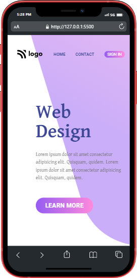
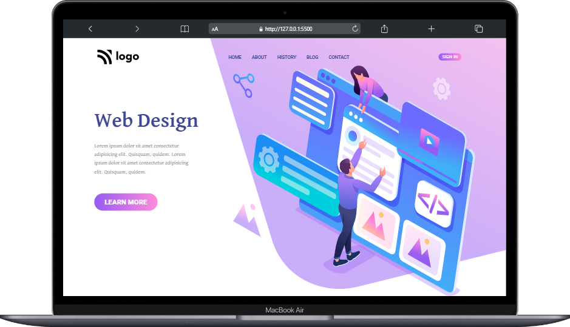
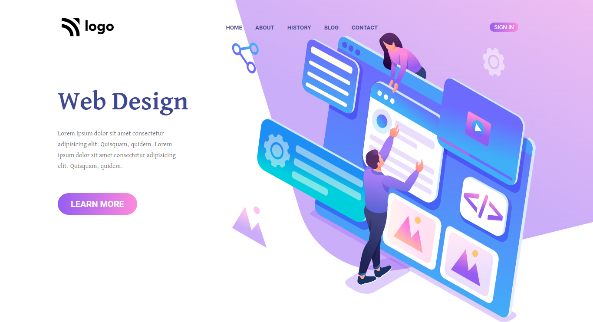

# Web Design Landing Page

***
## Description

This project [Web Design Landing Page]() was built using Semantic HTML and CSS. The main goal for building this webpage to apply my learning and make the webpage responsive for all major devices. In this project I learned about **linear-gradient** function on buttons and how to handle SVGs with the help of position property and other CSS properties. The Project was completed under guidance of [Hitesh Choudhary](https://github.com/hiteshchoudhary), CTO Ineuron

***

### Links for Project

* [LIVE Project Link]()

* [Youtube Video Demo]()

* [Source Code]()

***
### Built With 

* Semantic HTML
* Custom CSS classes
* FlexBox
* Positions
* Media Queries

***

### Key Learnings

*  Learned to use positions(absolute & relative) to handle SVGs on the webpage
* Learned to use Linear-gradient function to progressive transition between two or more colors on the buttons(in straight line).
* Learned using [flexbox](https://developer.mozilla.org/en-US/docs/Web/CSS/flex)
* Learned to use [z-index](https://developer.mozilla.org/en-US/docs/Web/CSS/z-index)
* Learned to make webpage responsive with the help of [media queries](https://developer.mozilla.org/en-US/docs/Web/CSS/Media_Queries/Using_media_queries)

***

### Time Taken to finish this project
 

>3 hours to style the webpage and make it responsive also.

 

***

### Screencaptures of Project

 

  1. #### Mobile View

 

 

  2. #### Large Screen View 

   

  

   

  3. #### Extra-large Screens View

   

  

   

***

### Checkout Portfolio & Other Projects

#### [Personal Portfolio]()

#### [Findcoder Profile]()
***

### Connect with Me
* [Mailto](mailto:shubhambhoj3@gmail.com)
* [LinkedIn]()
* [Github]()
* [Findcoder]()
***
***
[go to top](#web-design-landing-page)